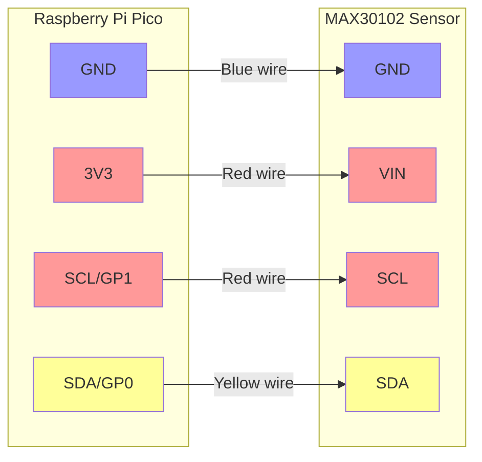
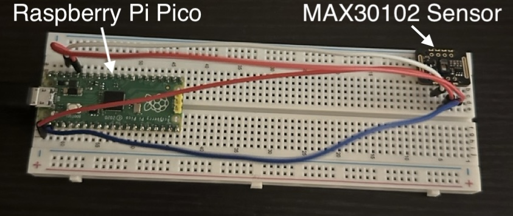

# pulseox_dataviz

This project uses a MAX30102 Pulse Oximetry Sensor and Raspberry Pi Pico to capture oxygen saturation level (SpO2) in percent and visualize them, along with the raw light intensities used to calculate the SpO2 (i.e., IR and red frequencies).

## How to run

1. Connect computer and Raspberry Pi Pico, and uploading ```main.py``` and ```max30102.py``` onto the Raspberry Pi Pico (e.g., via Thonny). Press play on ```main.py```, then quit Thonny.
   - When you plug the Pi Pico into your laptop/local machine, the MAX sensor should light up red -- this indicates the Pi Pico is running ```main.py``` and reading serial data from the MAX sensor.
2. Install dependencies: run ```npm install``` in both the ```bridge``` and ```web-app``` directories.
3. In this repo within ```bridge``` directory, first run the bridge script with ```node server.js```. This allows data to flow between the Pi Pico and your local machine.
4. Then in a new terminal window, inside ```web-app``` directory, execute ```npm run dev```. Open the local URL displayed to see visualization with finger on sensor.

## Overview

pulseox_dataviz/

├── bridge/

│ ├── server.js # Main bridge script

├── pico/

│ ├── main.py # Main Pico script (consistently runs once placed on Pico and Pico is connected via USB to computer)

│ ├── max30102.py # Sensor library

│ └── requirements.txt # Python dependencies

│

└── web-app/ # React application

├── src/

│ ├── components/

│ ├── RawSignalMonitor.jsx

│ ├── SpO2Monitor.css

│ └── SpO2Monitor.jsx

├── App.jsx

├── App.css

├── index.css

└── main.jsx

│

├── package.json

└── index.html

## Hardware Setup

Preliminary note: the MAX30102 sensor is very sensitie to movement in this circuit -- handle the sensor very gently when the light is on and taking measurements, or else the data stream may be interrupted. If this happens and the red light goes out, restart both local scripts.

Connect the MAX30102 sensor to the Raspberry Pi Pico using the following pins:

| MAX30102 Pin | Pico Pin | Wire Color |
|-------------|----------|------------|
| VIN         | 3V3      | Red        |
| GND         | GND      | Blue       |
| SCL         | GP1      | Red        |
| SDA         | GP0      | Yellow     |

**Notes:**

- The MAX30102 sensor uses I2C communication protocol
- The sensor operates at 3.3V (connect to 3V3, not VBUS)






## Helpful Related Projects/Tools

1. doug-burrell in repo [max30102](https://github.com/doug-burrell/max30102/blob/master/max30102.py)
2. To convert repo to txt (useful for chatting with LLMs about code base): [repo2txt tool](https://repo2txt.simplebasedomain.com/).
3. Project inspiration:
    - [MAX30102 tutorial](https://dev.to/shilleh/how-to-measure-heart-rate-and-blood-oxygen-levels-with-max30102-sensor-on-a-raspberry-pi-using-python-50hc)
    - [Extra tutorial with different devices](https://github.com/tobiasisenberg/OxiVis/blob/master/example-data/oximeter-20200705-145239-83376-test%20trace.pdf)
